# Analysis Tools

This folder contains the visualization and analysis tools developed for BackdoorBench. The demo scripts for utilizing such tools are given in **demo.sh**. The jupyter notebook for utilizing such tools are in **Demos** folder.

The implemented tools and corresponding scripts are
* visual_tsne.py
    * **T-SNE**,  the T-SNE of features. Typical output is 
    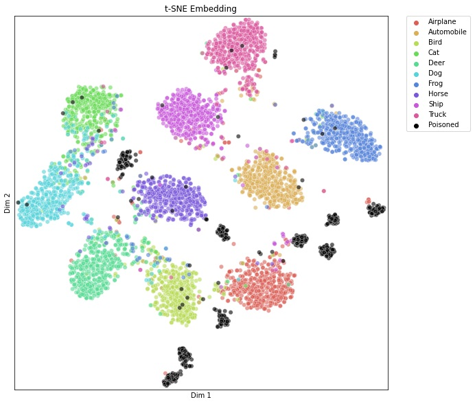

* visual_umap.py
    * **UMAP**,  the UMAP of features. Both UMAP and T-SNE can be used for dimension reduction, i.e., reducing the dimension of given features. But, UMAP is much faster than T-SNE which allows us to use more samples for a more comprehensive view. Typical output is 
    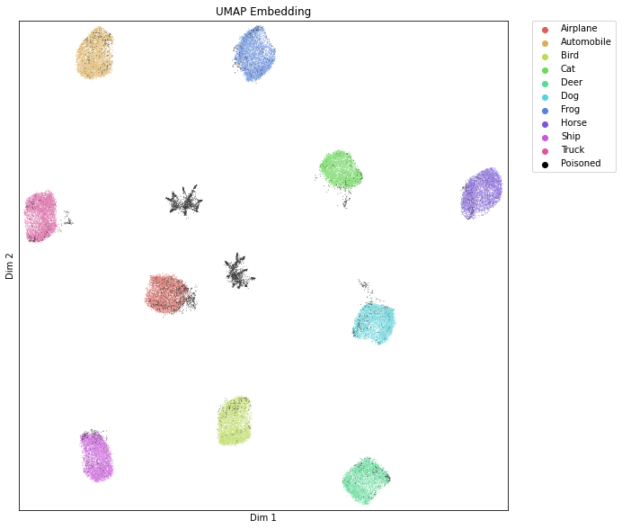

* visual_na.py
    * **Neuron Activation**, the activation value of a given layer of Neurons. Typical output is 
    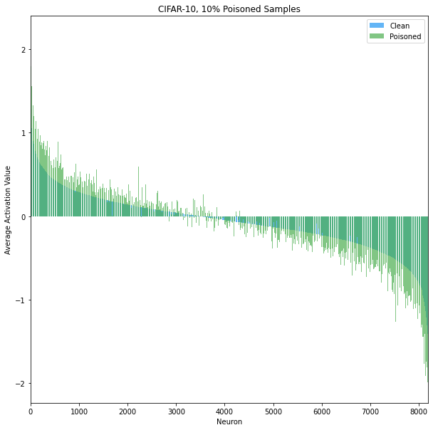

* visual_shap.py
    * **Shapely Value**, the Shapely Value for given inputs and a given layer. Typical output is 
    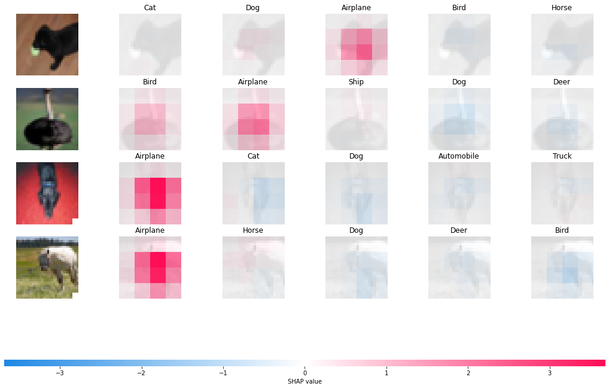

* visual_gradcam.py
    * **Grad-CAM**, the Grad-CAM for given inputs and a given layer. Typical output is 
    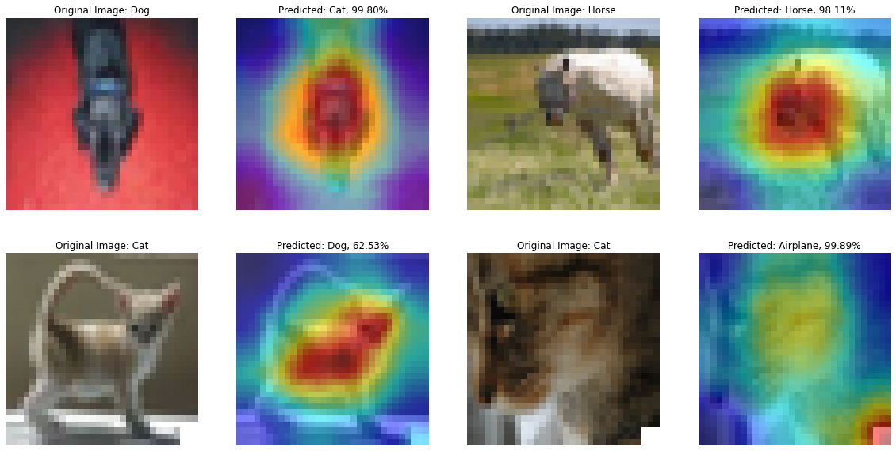

* visualize_fre.py
    * **Frequency Map**, the Frequency Saliency Map for given inputs and a given layer. Typical output is 
    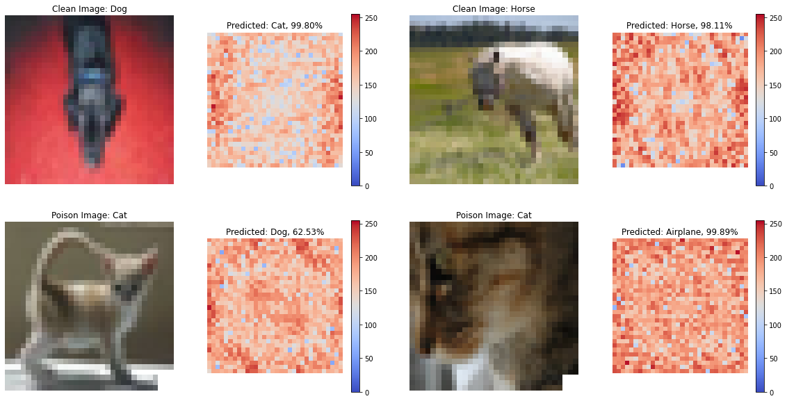

* visual_act.py
    * **Activated Image**, the top images who activate the given layer of Neurons most. Typical output is 
    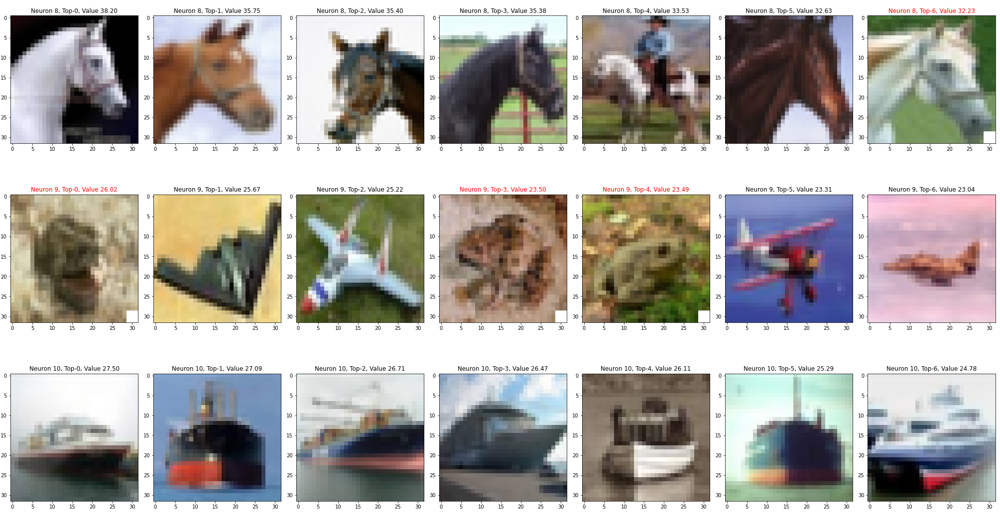
    The poiso samples are marked with **red** title.

* visual_cm.py
    * **Confusion Matrix**. Typical output is  
    

* visual_fv.py
    * **Feature Visualization**, the synthetic images which activate the given layer of Neurons most. The image is generated by Projected Gradient Descend. Typical output is 
    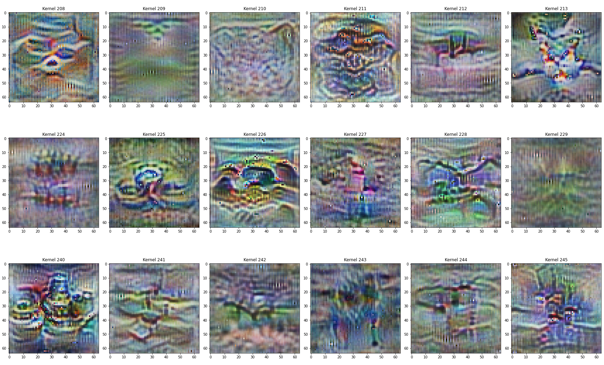

* visual_fm.py
    * **Feature Map**, the output of a given layer of CNNs for a given image. Typical output is 
    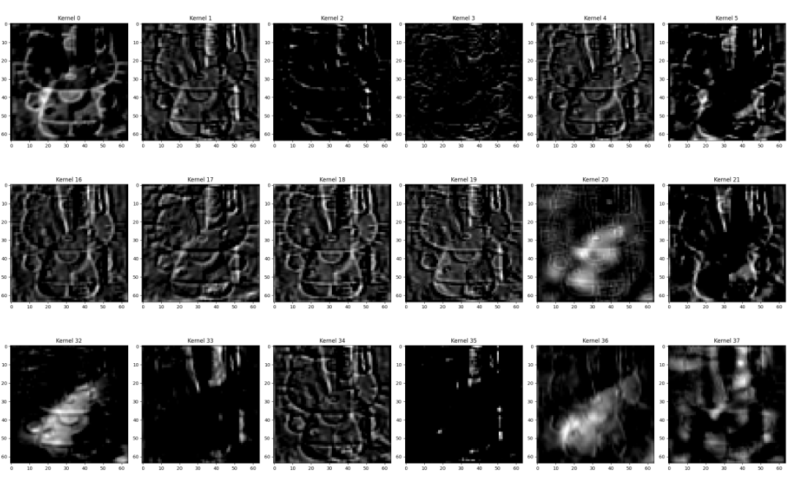


* visual_actdist.py
    * **Activation Distribution**, the class distribution of Top-k images which activate the Neuron most. Typical output is 
    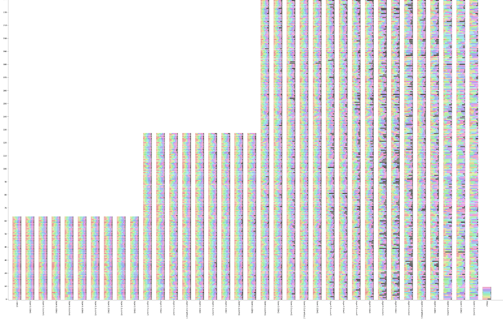

* visual_tac.py
    * **Trigger Activation Change**, the average (absolute) activation change between images with and without triggers. Typical output is 
    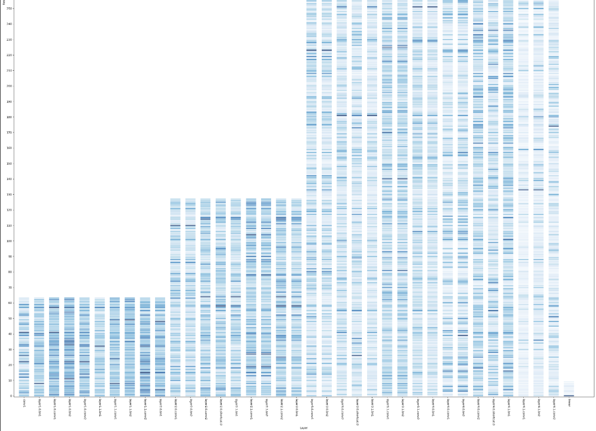

* visual_lips.py
    * **Lipschitz Constant**, the lipschitz constant of each neuron. Typical output is 
    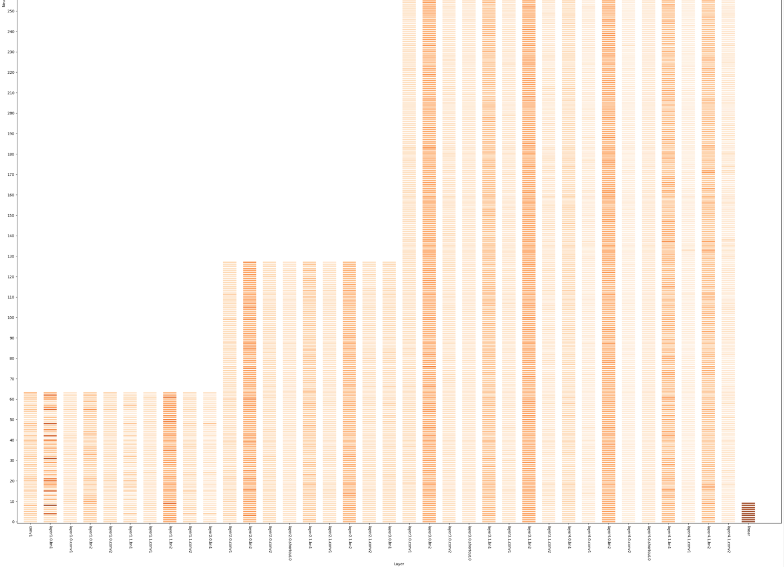 

* visual_landscape.py
    * **Loss Landscape**, the loss landscape of given results with two random directions. Typical output is 
    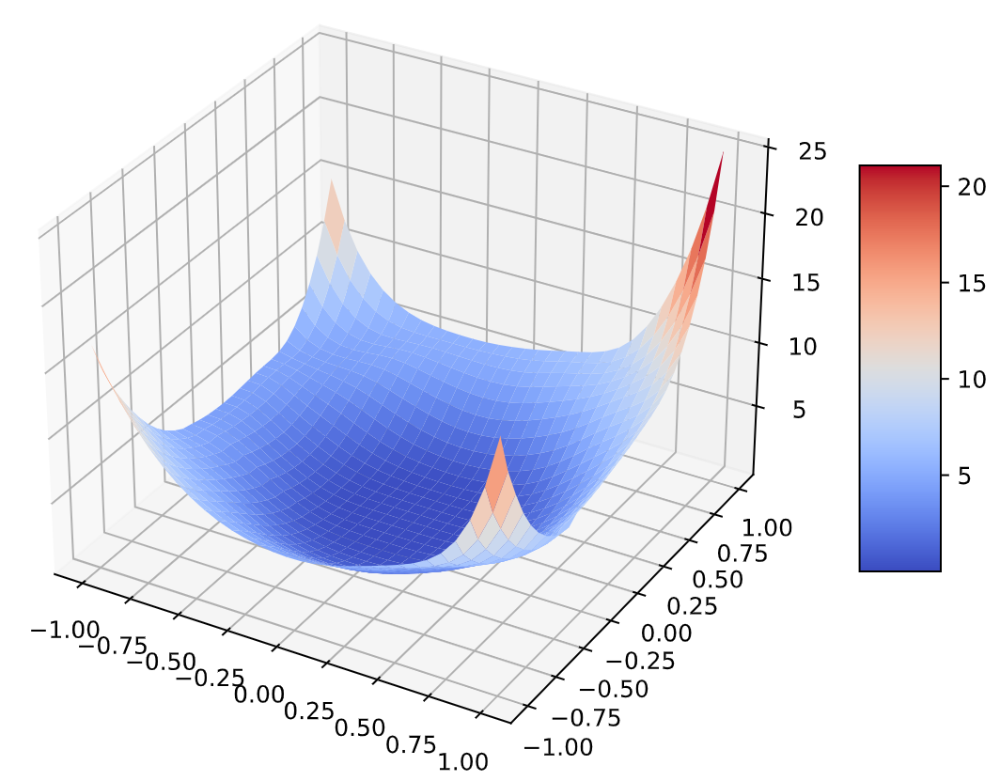
    More details can be founded in the subfolder loss_landscape.

* visual_network.py
    * **Network Structure**, the Network Structure of given model. We provide two ways to visualize the network structure. Typical outputs are 
    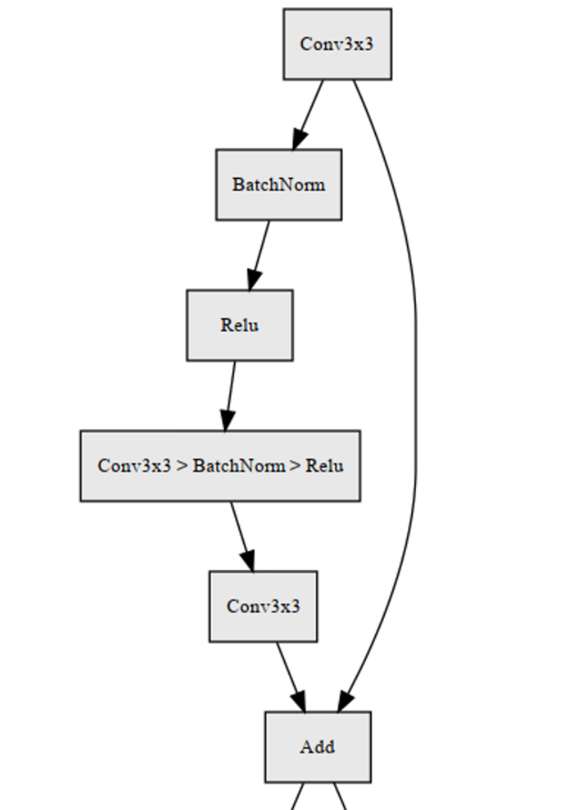
    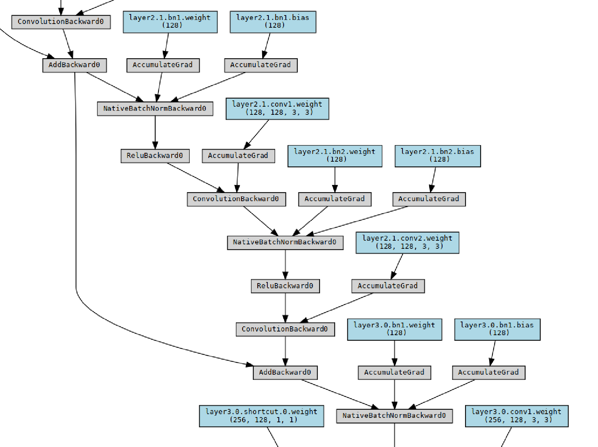

* visual_hessian.py
    * **Eigenvalues of Hessian**, the dense plot of hessian matrix for a batch of data. Typical output is 
    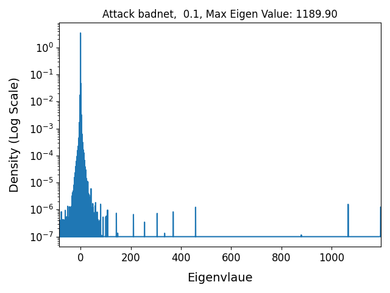

* visual_metric.py
    * **Metrics**, evaluating the given results using some metrics. Both csv file and visualization are given. Typical output is 
    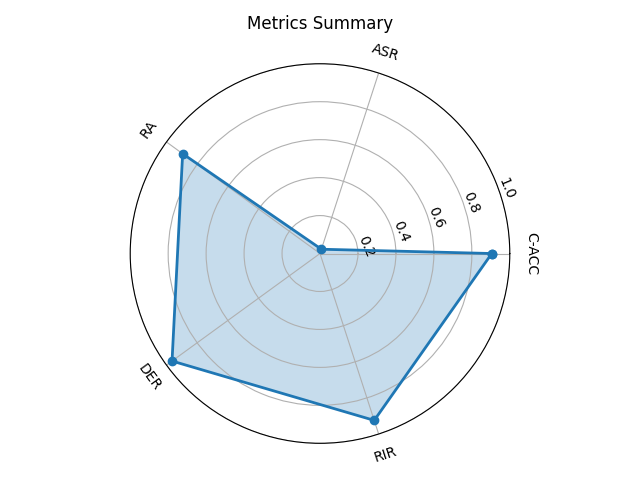

* visual_quality.py
    * **Image Quality**, evaluating the given results using some image quality metrics. The csv file is given.


* Dataset used for visualization. 
    * Mixed Test is generated by sampling data from both Clean Test and BD Test by a poison ratio *pratio* given in args.
    * Subset is default to sample 5000 samples with *n_sub* in args.
    * By default, all methods use **BD train** dataset for visualization (if needed).
    * For clean model trained using *prototype.py*, the results can be loaded using args 'prototype'. However, only clean dataset can be loaded and some methods cannot be adopted to analyze such results.
    * Supported dataset types for each method is given in the following table

    |        Script        |          Method         | Clean Train | BD Train | Clean Test | BD Test  | Mixed Test |  Subset  | Remark |
    |----------------------|-------------------------|:-----------:|:--------:|:----------:|:--------:|:----------:|:--------:|:------:|
    | visual_tsne.py       | T-SNE                   |   $\surd$   | $\surd$  |  $\surd$   | $\times$ |   $\surd$  |  $\surd$ |        |
    | visual_umap.py       | UMAP                    |   $\surd$   | $\surd$  |  $\surd$   | $\times$ |   $\surd$  |  $\surd$ |        |
    | visual_na.py         | Neuron Activation       |   $\times$  | $\surd$  |  $\times$  | $\surd$  |   $\times$ |  $\surd$ | BD only|
    | visual_shap.py       | Shapely Value           |   $\surd$   | $\surd$  |  $\surd$   | $\surd$  |   $\surd$  |  $\surd$ |        |
    | visual_gradcam.py    | Grad-CAM                |   $\surd$   | $\surd$  |  $\surd$   | $\surd$  |   $\surd$  |  $\surd$ |        |
    | visual_fre.py        | Frequency Saliency Map  |   $\surd$   | $\surd$  |  $\surd$   | $\surd$  |   $\surd$  |  $\surd$ |        |
    | visual_act.py        | Activated Image         |   $\surd$   | $\surd$  |  $\surd$   | $\surd$  |   $\surd$  |  $\surd$ |        |
    | visual_cm.py         | Confusion Matrix        |   $\surd$   | $\surd$  |  $\surd$   | $\surd$  |   $\times$ |  $\times$|        |
    | visual_fv.py         | Feature Visualization   |   $\times$  | $\times$ |  $\times$  | $\times$ |   $\times$ |  $\times$|        |
    | visual_fm.py         | Feature Map             |   $\surd$   | $\surd$  |  $\surd$   | $\surd$  |   $\times$ |  $\times$|        |
    | visual_actdist.py    | Activation Distribution |   $\surd$   | $\surd$  |  $\surd$   | $\surd$  |   $\surd$  |  $\surd$ |        |
    | visual_tac.py        | Trigger Activation Change |   $\times$  | $\surd$  |  $\times$  | $\surd$  |   $\times$ |  $\surd$ | BD only|
    | visual_lips.py       | Lipschitz Constant      |   $\times$  | $\times$ |  $\times$  | $\times$ |   $\times$ | $\times$ |        |
    | visual_landscape.py  | Loss Landscape          |   $\surd$   | $\surd$  |  $\times$  | $\times$ |   $\times$ | $\times$ |        |
    | visual_network.py    | Network Structure       |   $\times$  | $\times$ |  $\times$  | $\times$ |   $\times$ | $\times$ |        |
    | visual_hessian.py    | Eigenvalues of Hessian  |   $\surd$   | $\surd$  |  $\surd$   | $\surd$  |   $\times$ | $\times$ |        |
    | visual_metric.py     | Metrics          |   $\times$   | $\times$  |  $\surd$   | $\surd$  |   $\times$ | $\times$ |        |
    | visual_quality.py    |   Image Quality  |   $\times$   | $\surd$  |  $\times$   | $\surd$  |   $\surd$ | $\surd$ |        |
    
* Additional note for Loss Landscape
    * **Message Passing Interface (MPI)** is needed to accelerate the computation of loss landscape. Thus, you will need to install mpi4py. mpi4py can be installed either using pip or conda, but with pip you will need to install MPI yourself first (e.g. OpenMPI or MPICH), while conda will install its own MPI libraries. For example, you can run the following commands in your terminal to install mpi4py:
    ``` 
    sudo apt install libopenmpi-dev
    pip install mpi4py
    ```
    or
    ``` 
    conda install -c conda-forge mpi4py
    ``` 
    * You need also clone the repo https://github.com/tomgoldstein/loss-landscape to the ***visualization*** folder.
    * To run the landscape visualization using MPI (parallel), you can run the command 
    ``` 
    mpirun -n num_gpu python visual_landscape.py 
    ``` 
    * For more information, please refer to https://github.com/tomgoldstein/loss-landscape/blob/master/README.md
    
* Additional note for network structure
    * GraphViz and its Python wrapper are needed by hiddenlayer and pytorchviz to generate network graphs. Similar as MPI, you can install them using pip or conda. For example, you can run the following commands in your terminal to install them
    ``` 
     sudo apt install graphviz
     pip3 install graphviz
     pip install hiddenlayer
     pip install -U git+https://github.com/szagoruyko/pytorchviz.git@master
    ```
    or
    ``` 
     conda install graphviz python-graphviz
     pip install hiddenlayer
     pip install -U git+https://github.com/szagoruyko/pytorchviz.git@master
    ``` 
    * For more information, please refer to https://github.com/waleedka/hiddenlayer/blob/master/README.md or https://github.com/szagoruyko/pytorchviz/blob/master/README.md


## Acknowledge
Our implementation is partially built based on 
- https://github.com/utkuozbulak/pytorch-cnn-visualizations
- https://github.com/slundberg/shap
- https://github.com/jacobgil/pytorch-grad-cam
- https://github.com/tomgoldstein/loss-landscape
- https://github.com/salesforce/OmniXAI        
- https://github.com/waleedka/hiddenlayer  
- https://github.com/szagoruyko/pytorchviz        